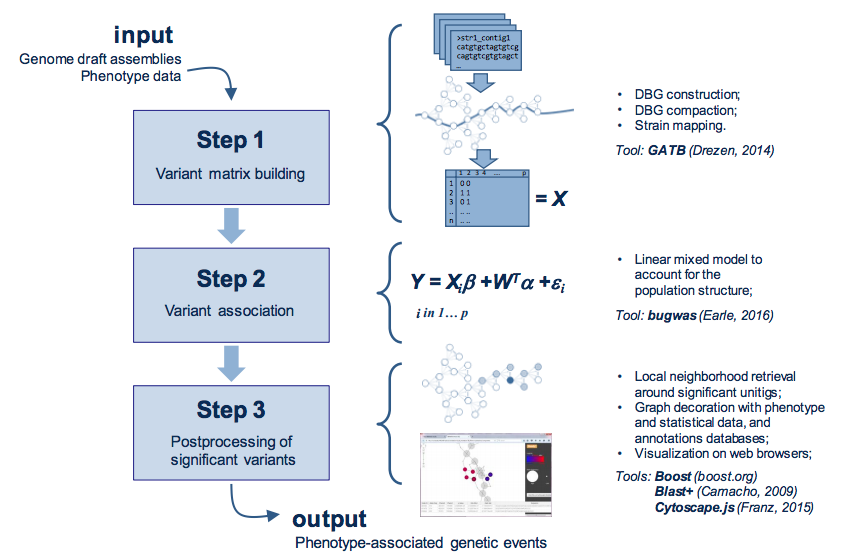

# NEWS
* DBGWAS v0.5.4 is now released. Many changes:
    1. DBGWAS now accepts continuous phenotypes:
        * The allowed values for phenotypes now are any real number or NA. In particular, 0/1 binary phenotypes are still valid values. 
    2. Textual output feature added:
        * Produces a textual output of DBGWAS graphical output. It can be used to easily plug DBGWAS' results on pipelines,
        and post-process them, for example to compare different GWAS runs.
        See the produced files and their formats here: https://gitlab.com/leoisl/dbgwas/wikis/Files-and-formats-of-DBGWAS-textual-output.
    3. Visualisation changes:
        * p-value added to the visualisations, and components are now sorted by default by the p-value;
        * Several other improvements;
    4. Parameter -SFF changed:    
        * Now, two arguments must be given to this parameter.
	The first (q or p) indicates whether q- or p-values are used to control the number of retained patterns.
	The second argument is a number. If it is a float number n, then only the features with q/p-value <=n are selected.
        If it is an integer n, then only the n first features are selected. Note that there is no space between these parameters, e.g. q100.
    5. Parameter -keepNA added:
        * Keep strains with phenotype NA in the analysis, instead of ignoring them;
    6. Parameter -phenoThreshold added:
        * Phenotype threshold. Values <= than this are considered Phenotype 0, and > than this are considered Phenotype 1. Used only on the visualisation.
    7. DBGWAS is now on docker:
        * See https://gitlab.com/leoisl/dbgwas/tree/master/containers/docker for instructions on how to use it;

**Download the new version here: [Downloading the precompiled binaries](#downloading-the-precompiled-binaries).**


# Before starting
If you have any problems, please try to find your answer in this page or in the [issues page](https://gitlab.com/leoisl/dbgwas/issues?scope=all&utf8=%E2%9C%93&state=all).

If your problem persists, please do not hesitate on submitting an issue to the [issues page](https://gitlab.com/leoisl/dbgwas/issues), as this can help the developers and other users.

**DBGWAS ONLY WORKS ON LINUX FOR THE MOMENT.**

**DBGWAS' OUTPUT IS ONLY TESTED WITH GOOGLE CHROME, FIREFOX AND OPERA BROWSERS.**

# About DBGWAS
DBGWAS is a tool for quick and efficient bacterial GWAS. It uses a compacted De Bruijn Graph (cDBG) structure to represent the variability within all bacterial
genome assemblies given as input. Then cDBG nodes are tested for association with a phenotype of interest and the resulting associated nodes are then re-mapped
on the cDBG. The output of DBGWAS consists of regions of the cDBG around statistically significant nodes with several informations related to the phenotypes,
offering a representation helping in the interpretation. The output can be viewed with any modern web browser, and thus easily shared.
A complete description of DBGWAS and its application can be found in its publication: [https://journals.plos.org/plosgenetics/article?id=10.1371/journal.pgen.1007758](https://journals.plos.org/plosgenetics/article?id=10.1371/journal.pgen.1007758)


## DBGWAS pipeline
DBGWAS takes as input draft assemblies and phenotype data for a panel of
bacterial strains. Variant matrix `X` is built in step 1 using cDBG nodes.
Variants are tested in step 2 using a linear mixed model.
Significant variants are post-processed in step 3 to provide an interactive
interface assisting their interpretation.




# Could DBGWAS be useful to me? - a quick glance at DBGWAS' output

You can find DBGWAS' output using several antibiotic resistance phenotypes within three bacterial species of various degrees of genome plasticity (Mycobacterium tuberculosis, Staphylococcus aureus and Pseudomonas aeruginosa) here: http://pbil.univ-lyon1.fr/datasets/DBGWAS_support/experiments/#DBGWAS_all_results .

The input to each of these experiments are the IDs, phenotypes and contigs for each strain. The details of each dataset can be found in the [full text](#how-to-cite).

A detailed description of the output can be found in [DBGWAS web based interactive visualization Wiki page](https://gitlab.com/leoisl/dbgwas/wikis/DBGWAS-web-based-interactive-visualization) .

# DBGWAS in a nutshell - running the tool in one example

For a quick example on how DBGWAS works, we provide the output
obtained from 282 bacterial genomes of Pseudomonas aeruginosa along with their drug (amikacin) resistance/sensitivity
phenotype.

Genomes are taken from [van Belkum A et al., "Phylogenetic Distribution of CRISPR-Cas Systems in Antibiotic-Resistant Pseudomonas aeruginosa.", MBio, 2015 Nov 24;6(6):e01796-15](http://mbio.asm.org/content/6/6/e01796-15.full)

Phenotypes are taken from [Jaillard M et al. ,"Correlation between phenotypic antibiotic susceptibility and the resistome in Pseudomonas aeruginosa". IJAA , 50 (2017) 210-218.](https://www.ncbi.nlm.nih.gov/pubmed/28554735)

The graph nodes were annotated with a resistance database composed by four sources (ResFinders, MEGAres, ArgAnnot and CARD) and the UniProt database of bacterial proteins (http://www.uniprot.org/).

The output can be found here: http://pbil.univ-lyon1.fr/datasets/DBGWAS_support/full_dataset_visualization/

For reproducibility reasons, in the following you have easily the input data, annotation databases and command-line to generate the above output:

1. Strains' sequences along with DBGWAS' required files (input): https://www.dropbox.com/s/0g1llvdbfv1jys6/pseudomonas_aeruginosa_full_dataset.zip?dl=1
2. Resistance database: https://www.dropbox.com/s/mt3g4oh0bt5jwmr/Resistance_DB_for_DBGWAS.fasta?dl=1
3. UniProt database: https://www.dropbox.com/s/9y1p0yw918ips6k/uniprot_sprot_bacteria_for_DBGWAS.fasta?dl=1
4. Extract everything in the `bin` of the [precompiled binary](#downloading-the-precompiled-binaries) folder and execute DBGWAS as:
```
./DBGWAS -strains pseudomonas_aeruginosa_full_dataset/strains -newick pseudomonas_aeruginosa_full_dataset/strains.newick -nc-db Resistance_DB_for_DBGWAS.fasta -pt-db uniprot_sprot_bacteria_for_DBGWAS.fasta
```
5. After finishing the execution, the output can be found in the folder ```bin/output/visualisations```

# Downloading, installing and running

## Using containers

The easiest way to run DBGWAS is using [singularity](https://sylabs.io/docs/) as all dependencies are dealt with automatically.
See [Running DBGWAS on singularity](containers/docker#running-dbgwas-on-singularity).

An alternative is to run DBGWAS using [docker](https://www.docker.com/). See [Running DBGWAS on docker](containers/docker#running-dbgwas-on-docker).

## Downloading the precompiled binaries
If you prefer to not use containers, you can download the precompiled binary. This binary requires having `R` and the `R` dependencies installed.

Download the latest binary here (v0.5.4): https://www.dropbox.com/s/s9oojqfl1kgi4l5/DBGWAS-0.5.4-Linux-precompiled.tar.gz?dl=1

Previous versions:

0.5.2: https://www.dropbox.com/s/gf6n4ibcakcyo5k/DBGWAS-0.5.2-Linux-precompiled.tar.gz?dl=1

**Note:** even in this case, you still have to install the R dependencies (see [Dependencies installation](#dependencies-installation)).

If the precompiled binary worked on your machine, you can jump to section [Dependencies installation](#dependencies-installation). Otherwise, see the next sections.

### Details about the precompiled binary

Precompilation is done using [Holy Build Box](http://phusion.github.io/holy-build-box/), so it should work on
pretty much any glibc-based x86 and x86-64 Linux distribution released since approx 2011 (e.g.: Debian >= 7, Ubuntu >= 10.10,
Red Hat Enterprise Linux >= 6, CentOS >= 6, etc). We acknowledge Páll Melsted since we followed his
[blog post](https://pmelsted.wordpress.com/2015/10/14/building-binaries-for-bioinformatics/) to build this portable binary.

We attested that the precompiled binary works on Debian 7.11.0 or later, Ubuntu 14.04.5 or later, and CentOS 7 or later, but it should work on
all distributions supported by [Holy Build Box](http://phusion.github.io/holy-build-box/).

### Help, I can't run the precompiled binaries!
Despite all our efforts, DBGWAS or the other binaries it uses might not work on your particular machine.
In this case, you can compile these binaries yourself and tell DBGWAS to use them instead of the ones that are distributed in DBGWAS package.
If you have problem with:

* DBGWAS binary: try compiling from the source: [Compiling](#compiling)
* GEMMA binary: bugwas requires a modified GEMMA version 0.93 to work. We created a static portable binary of this specific version available here: https://github.com/leoisl/gemma0.93b , which is already distributed with DBGWAS.
However, if you need to compile your own version of GEMMA, try compiling the version at https://github.com/danny-wilson/gemma0.93b and tell DBGWAS to use your own executable by using parameter `-GEMMA-path`.
   * GEMMA is **required** for DBGWAS to work.
* Rscript: by default, DBGWAS uses the Rscript in your PATH. If this is not the version you want to use, you can specify other Rscript executable using parameter `-Rscript-path`.
   * Rscript is **required** for DBGWAS to work.
* [Blast suite](https://blast.ncbi.nlm.nih.gov/Blast.cgi) (blastn, blastx, makeblastdb): if you prefer to use your own installation of Blast, use parameter `-Blast-path`.
   * Blast suite is only required if you want to annotate the output subgraphs with parameters `-nc-db` and `-pt-db`.
* phantomjs: if you prefer to use your own installation of phantomjs, use parameter `-phantomjs-path`.
   * phantomjs is only required to have the components preview in the summary output page. If you prefer not to have them or if you do not manage to
   have a working phantomjs executable, you can still run DBGWAS with parameter `-no-preview`, which will skip producing the components preview.

**In case nothing works, please fill an issue at https://gitlab.com/leoisl/dbgwas/issues**

## Compiling

If you need to compile, first have installed:
```
GCC 4.8.2+
cmake v3.6+
make
zlib 1.2.11+
git
```

Then, clone the repository:
```
git clone --recursive https://gitlab.com/leoisl/dbgwas.git
```

And build the package:
```
cd dbgwas && mkdir build && cd build && cmake -DCMAKE_BUILD_TYPE=Release .. && make && cd DBGWAS/DBGWAS && make package
```

The package can be found in `build/DBGWAS/DBGWAS/DBGWAS-<version>-Linux-precompiled.tar.gz`.

## Dependencies installation
DBGWAS uses several thirdparty libraries, but most of them were already packed and were statically linked during compilation, so almost no dependencies are needed. However, in order to run the tool, you still need to:

1. Install bugwas (an R package). You will need `R >= 3.2.0` and to execute these commands:

```
R
install.packages("ape")
install.packages("phangorn")
install.packages("https://raw.githubusercontent.com/sgearle/bugwas/master/build/bugwas_1.0.tar.gz", repos=NULL, type="source")
```

## Running on a sample example

Now that you have the package (either from the container, or precompiled or you compiled it yourself),
let's try running the tool in a sample example comprising 50 bacterial genomes (subset of the 282
described in the [DBGWAS in a nutshell](#dbgwas-in-a-nutshell-running-the-tool-in-one-example) section):

1. Extract the package:
```
tar -zxvf DBGWAS-<version>-Linux-precompiled.tar.gz
```
2. Go to the binary folder:
```
cd bin/
```
3. Execute the program on the sample example:
```
./DBGWAS -strains ../sample_example/strains -newick ../sample_example/strains.newick
```
4. The main output, which are subgraphs that can be visualised with any modern web browser, can be found in ```bin/output/visualisations/index.html```
5. For help and understanding the parameters:
```
./DBGWAS -h
```
6. See also the directory ```sample_example``` to understand better this example.
Check at least the file ```sample_example/strains``` to know how to build the input to the program.

## Parameters

You can find DBGWAS parameters by running ```./DBGWAS -h``` or simply here:
```
       -strains        (1 arg) :    A text file describing the strains containing 3 columns: 1) ID of the strain; 2) Phenotype (a real number or NA); 3) Path to a multi-fasta file containing the sequences of the strain. This file needs a header. Check the sample_example folder or https://gitlab.com/leoisl/dbgwas/raw/master/sample_example/strains for an example.
       -k              (1 arg) :    K-mer size.  [default '31']
       -newick         (1 arg) :    Optional path to a newick tree file. If (and only if) a newick tree file is provided, the lineage effect analysis is computed and PCs figures are generated.  [default '']
       -nc-db          (1 arg) :    A list of Fasta files separated by comma containing annotations in a nucleotide alphabet format (e.g.: -nc-db path/to/file_1.fa,path/to/file_2.fa,etc). You can customize these files to work better with DBGWAS (see https://gitlab.com/leoisl/dbgwas/tree/master#customizing-annotation-databases).  [default '']
       -pt-db          (1 arg) :    A list of Fasta files separated by comma containing annotations in a protein alphabet format (e.g.: -pt-db path/to/file_1.fa,path/to/file_2.fa,etc). You can customize these files to work better with DBGWAS (see https://gitlab.com/leoisl/dbgwas/tree/master#customizing-annotation-databases).  [default '']
       -output         (1 arg) :    Path to the folder where the final and temporary files will be stored.  [default 'output']
       -SFF            (1 arg) :    Denotes the Significant Features Filter - the features (or patterns) selected to create a visualisation around them. Two arguments must be given to this parameter. The first (q or p) indicates whether q- or p-values are used to control the number of retained patterns. The second argument is a number. If it is a float number n, then only the features with q/p-value <=n are selected. If it is an integer n, then only the n first features are selected. Note that there is no space between these parameters, e.g. q100. Take a look at the output/step2/patterns.txt file to get a list of features ordered by q/p-value to better choose this parameter (re-run the tool with -skip2 in order to directly produce the visualisation of the features selected by your parameter).  [default 'q100']
       -nh             (1 arg) :    Denotes the neighbourhood to be considered around the significant unitigs.  [default '5']
       -maf            (1 arg) :    Minor Allele Frequency Filter.  [default '0.01']
       -phenoThreshold (1 arg) :    Phenotype threshold. Values <= than this are considered Phenotype 0, and > than this are considered Phenotype 1. Used only on the visualisation.  [default '0.0']
       -keepNA         (0 arg) :    Keep strains with phenotype NA.
       -skip1          (0 arg) :    Skips Step 1, running only Steps 2 and 3. Assumes that Step 1 was correctly run and folder "step1" is present in the output folder.
       -skip2          (0 arg) :    Skips Steps 1 and 2, running only Step 3. Assumes that Steps 1 and 2 were correctly run and folders "step1" and "step2" are present in the output folder.
       -GEMMA-path     (1 arg) :    Path to the GEMMA executable.  [default '<DBGWAS_lib>/gemma.0.93b']
       -Blast-path     (1 arg) :    Path to the directory containing the Blast suite (should contain at least blastn, blastx, and makeblastdb).  [default '<DBGWAS_lib>/']
       -phantomjs-path (1 arg) :    Path to phantomjs executable (DBGWAS was tested only with version 2.1.1).  [default '<DBGWAS_lib>/phantomjs']
       -no-preview     (0 arg) :    Do not produce the components preview in the summary output page.
       -Rscript-path   (1 arg) :    Path to Rscript.  [default 'Rscript']
       -nb-cores       (1 arg) :    number of cores  [default '1']
       -verbose        (1 arg) :    verbosity level  [default '1']
       -version        (0 arg) :    version
       -help           (0 arg) :    help
```

## User case studies
Some interesting user case studies can be found here: [User case studies](http://pbil.univ-lyon1.fr/datasets/DBGWAS_support/user_case_studies/index.html).

These case studies might help future users if they have a dataset similar to the ones tested here and wonder how DBGWAS would behave in their datasets.

We thank the users a lot and we appreciate their time for providing us the description and the output of DBGWAS in these examples. All credits go to the users.

If you want your case study to be featured here, please send the output and some description of your dataset by opening an issue at [https://gitlab.com/leoisl/dbgwas/issues](https://gitlab.com/leoisl/dbgwas/issues) or sending it by mail to leandro&lt;dot&gt;ishi&lt;dot&gt;lima&lt;at&gt;gmail&lt;dot&gt;com .


## Learning how to use the DBGWAS web based interactive visualization

See [DBGWAS web based interactive visualization](https://gitlab.com/leoisl/dbgwas/wikis/DBGWAS-web-based-interactive-visualization)

## Files and formats of DBGWAS textual output

See [Files and formats of DBGWAS textual output](https://gitlab.com/leoisl/dbgwas/wikis/Files-and-formats-of-DBGWAS-textual-output)


## Customizing annotation databases

DBGWAS works with any nucleotide or protein Fasta files as annotation databases straight away.
However, you can customize the annotation databases by changing the Fasta sequences' headers to aid the interpretability of DBGWAS results.
A common example is compacting the annotation in the summary page by using abbreviations or gene class names, and expanding them
to full names in the subgraph page. Other custom fields can also be included in the annotation table by adding specific
tags to the headers. See [Customizing annotation databases](https://gitlab.com/leoisl/dbgwas/wikis/Customizing-annotation-databases)
to know how to do this.


## Lineage vs locus effect

See [Lineage vs locus effect](https://gitlab.com/leoisl/dbgwas/wikis/Lineage-vs-locus-effect)


## Memory and CPU requirements

See [Memory and CPU requirements](https://gitlab.com/leoisl/dbgwas/wikis/Memory-and-CPU-requirements)


# Thirdparties
DBGWAS makes use of several thirdparty libraries:
1. GATB (https://github.com/GATB/gatb-core)
2. Boost C++ Libraries (http://www.boost.org/)
3. Bugwas (https://github.com/sgearle/bugwas)
4. GEMMA (https://github.com/genetics-statistics/GEMMA)
5. Blast (https://blast.ncbi.nlm.nih.gov/Blast.cgi)
6. Cytoscape.js (http://js.cytoscape.org/) and these extensions:
   1. cytoscape.js-cxtmenu (https://github.com/cytoscape/cytoscape.js-cxtmenu)
   2. cytoscape-ngraph.forcelayout (https://github.com/Nickolasmv/cytoscape-ngraph.forcelayout)
   3. cytoscape.js-panzoom (https://github.com/cytoscape/cytoscape.js-panzoom)
7. PhantomJS (http://phantomjs.org/)
8. PStreams (http://pstreams.sourceforge.net/)
9. Where Am I? (https://github.com/gpakosz/whereami)
10. Alasql (https://github.com/agershun/alasql)
11. Handsontable (https://github.com/handsontable/handsontable)
12. Bootstrap (http://getbootstrap.com/javascript/)
13. jQuery (https://jquery.com/)
14. jQuery QueryBuilder (http://querybuilder.js.org/)
15. jQuery Layout (http://layout.jquery-dev.com/)
16. jQuery BlockUI Plugin (https://github.com/malsup/blockui/)
17. Shuffle.js (https://vestride.github.io/Shuffle/)
18. Fastclick (https://github.com/ftlabs/fastclick)
19. cmake-superbuild (https://github.com/Sarcasm/cmake-superbuild)
20. docker (https://www.docker.com/)
21. Holy Build Box (http://phusion.github.io/holy-build-box/)

# How to cite

Jaillard M, Lima L, Tournoud M, Mahé P, van Belkum A, Lacroix V, Jacob L. (2018) A fast and agnostic method for bacterial
genome-wide association studies: Bridging the gap between kmers and genetic events. PLoS Genet 14(11): e1007758.
https://doi.org/10.1371/journal.pgen.1007758

# License
Copyright (C) <2017>  <bioMerieux, Universite Claude Bernard Lyon 1,
Centre National de la Recherche Scientifique>

1. This program is free software: you can redistribute it and/or modify
it under the terms of the GNU Affero General Public License as published
by the Free Software Foundation version 3 of the  License and under the
terms of article 2 below.

2. This program is distributed in the hope that it will be useful, but
WITHOUT ANY WARRANTY; without even the implied warranty of MERCHANTABILITY
or FITNESS FOR A PARTICULAR PURPOSE. See below the GNU Affero General Public License for more details.
You should have received a copy of the GNU Affero General Public License
along with this program.  If not, see <http://www.gnu.org/licenses/>.

3. Communication to the public by any means, in particular in the form of
a scientific paper, a poster, a slideshow, an internet page, or a patent,
of a result obtained directly or indirectly by running this program must
cite the following paper :

Jaillard M, Lima L, Tournoud M, Mahé P, van Belkum A, Lacroix V, Jacob L. (2018) A fast and agnostic method for bacterial
genome-wide association studies: Bridging the gap between kmers and genetic events. PLoS Genet 14(11): e1007758.
https://doi.org/10.1371/journal.pgen.1007758

# Affiliations:

bioMérieux (http://www.biomerieux.fr/)

LBBE (https://lbbe.univ-lyon1.fr/?lang=en)

Erable (https://team.inria.fr/erable/en/)